# von1336

Fullstack-разработчик и системный инженер. Специализируюсь на архитектуре надежных серверных решений на Python (FastAPI, Django, Celery), высокопроизводительных веб-интерфейсах (React, чистый JavaScript, HTML5 Canvas 2D/3D), десктопных инструментах (C# .NET / WPF) и автоматизации сбора данных.

---

## Что я умею

### 1. Backend и системная архитектура
- Проектирование и реализация асинхронных REST API и сервисных архитектур на Python (FastAPI, Django REST Framework) и Node.js (Express).
- Построение распределенных очередей задач и асинхронной обработки данных через Celery и Redis с защитой от сбоев брокера (graceful fallback).
- Проектирование реляционных баз данных, оптимизация запросов, индексы и миграции (PostgreSQL, SQLite).
- Многоуровневое кэширование данных: Redis-кэш эндпоинтов и кэширование на уровне ORM через \django-cachalot\.
- Безопасность и авторизация: JWT-токены, OAuth2 (интеграция авторизации Google и GitHub), троттлинг запросов и Rate Limiting для защиты от перегрузок.
- Автоматическое документирование и генерация спецификаций OpenAPI / Swagger UI через \drf-spectacular\.
- Мониторинг производительности и сбор ошибок через Sentry для Django и Celery.
- Контейнеризация и воспроизводимое развертывание сервисов через Docker и Docker Compose.

### 2. Frontend и интерактивная графика
- Разработка современных веб-приложений и аналитических панелей на React 18/19 с Vite и библиотеками визуализации (Recharts).
- Создание легковесных высокоскоростных интерфейсов на чистом JavaScript (ES6+) без внешних фреймворков и без шага сборки (Zero-build architecture).
- Интерактивная 2D и 3D графика на HTML5 Canvas: системы частиц с физикой ускорения, симуляции орбитальной механики Кеплера, физические анимации механических узлов (турбийон с частотой 4Hz).
- Процедурный синтез звука через Web Audio API: программные осцилляторы, гармонические арпеджио, частотные фильтры и интерактивные звуковые ландшафты.
- Компонентные адаптивные интерфейсы: CSS Grid, Flexbox, кастомные CSS-переменные, плавная типографика clamp(), стили Neo-Brutalist, Cyberpunk и Luxury Editorial.
- Строгий визуальный контроль: векторная графика SVG и качественная фото-интеграция без использования неформальных эмодзи.

### 3. Автоматизация, парсинг и боты
- Разработка асинхронных Telegram-ботов на \iogram 3.x\ с модульной структурой хэндлеров, FSM (конечными автоматами) и интеграцией внешних REST API.
- Создание отказоустойчивых веб-парсеров (BeautifulSoup4, HTTP-пулы сессий, защитные таймауты) для сбора и валидации структурированных данных.
- Автоматизированная очистка, трансформация и экспорт данных в форматы CSV, JSON и Excel на базе Pandas.

### 4. Десктопная разработка и утилиты
- Создание настольных приложений для Windows на C# / .NET с графическим интерфейсом WPF.
- Управление системными процессами и фоновыми службами в реальном времени, локальная генерация QR-кодов для сопряжения с мобильными устройствами.
- Сборка и автоматизация развертывания через Inno Setup и сценарии PowerShell.

---

## Проекты в портфолио

| Проект | Описание | Технологии |
| :--- | :--- | :--- |
| **[interactive-web-showcase](https://github.com/von1336/interactive-web-showcase)** | Пакет из 5 интерактивных веб-сайтов: Canvas 2D/3D частицы, физический турбийон 4Hz, орбиты Кеплера, нео-бруталистский калькулятор и процедурный Web Audio | HTML5 Canvas, Web Audio API, Vanilla JS, CSS3 Grid |
| **[von-procurement-platform](https://github.com/von1336/von-procurement-platform)** | B2B платформа корпоративных закупок с REST API, интеграциями поставщиков, фоновыми задачами Celery, OAuth-авторизацией, кэшированием и деплоем в Docker | Python, Django 5, DRF, Celery, Redis, Docker |
| **[hermes-installer](https://github.com/von1336/hermes-installer)** | Десктопный лаунчер на WPF (C#) для управления сервисами в реальном времени, генерацией QR для мобильного подключения и Inno Setup инсталлятором | C#, .NET, WPF, PowerShell, Inno Setup |
| **[react-dashboard](https://github.com/von1336/react-dashboard)** | Адаптивная панель администратора с интерактивной аналитикой, динамическими графиками и темной темой | React 18, Vite, Recharts, JavaScript |
| **[ecommerce-api](https://github.com/von1336/ecommerce-api)** | REST API интернет-магазина с аутентификацией по JWT, управлением каталогом, заказами и корзиной | Node.js, Express, SQLite, JWT |
| **[telegram-bot](https://github.com/von1336/telegram-bot)** | Асинхронный Telegram-бот с модульной архитектурой, прогнозом погоды и калькулятором | Python 3, \iogram 3.x\, \syncio\ |
| **[web-scraper](https://github.com/von1336/web-scraper)** | Универсальный парсер данных с поддержкой структурированного экспорта в CSV, JSON и Excel | Python, BeautifulSoup4, Pandas |
| **[portfolio-site](https://github.com/von1336/portfolio-site)** | Адаптивный сайт-портфолио в темной теме с терминальной hero-секцией на чистом JavaScript | HTML5, CSS3, Vanilla JS |

---

## Стек технологий

**Backend & Базы данных:**  

**Frontend & Веб-графика:**  

**DevOps, Десктоп и автоматизация:**  

---

## Статистика активности

  
  

---

## Контакты

- **Telegram:** [@simulcra](https://t.me/simulcra)
- **GitHub:** [@von1336](https://github.com/von1336)
